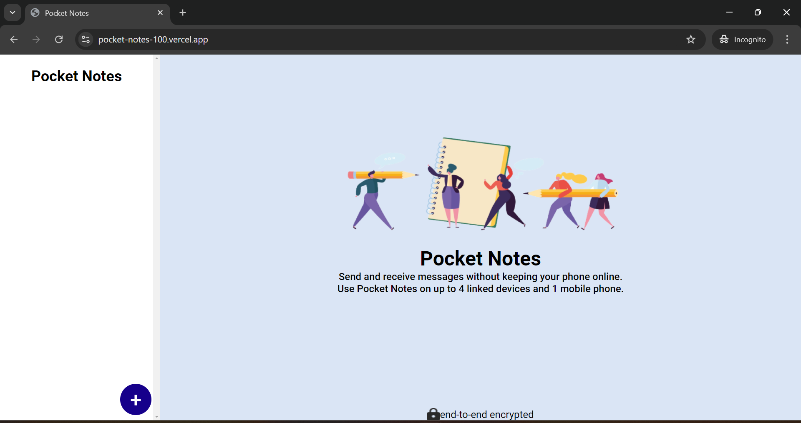
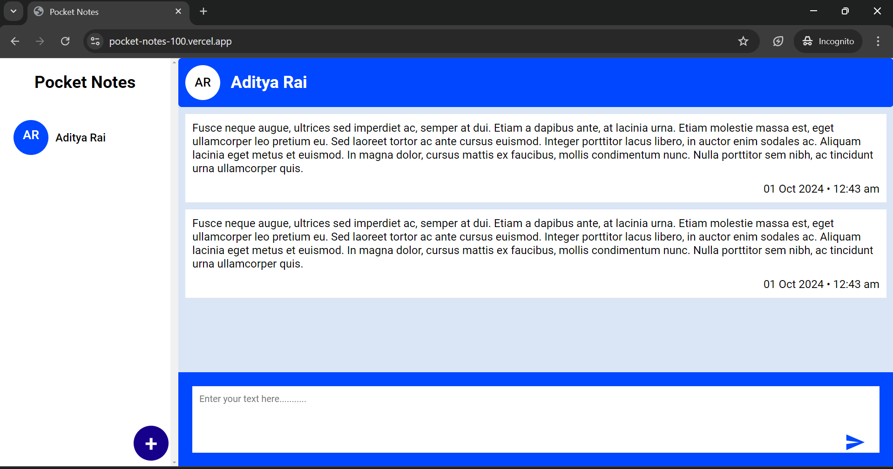
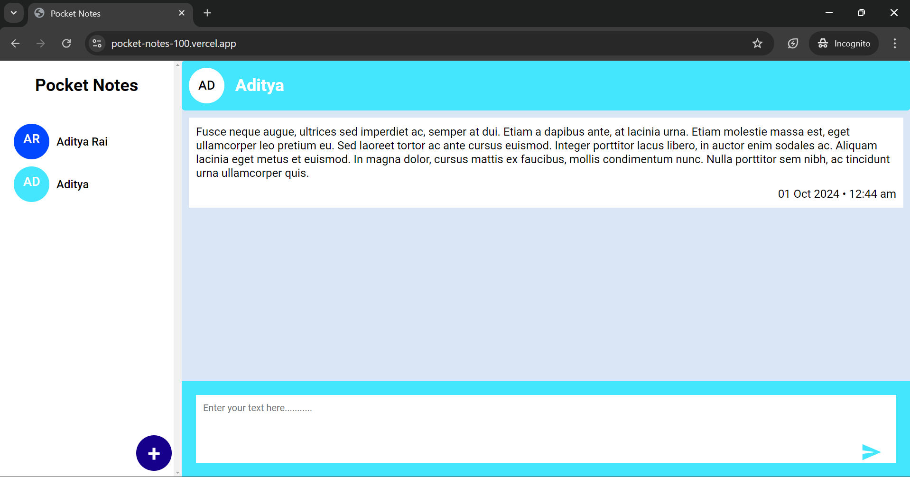

📝 Notes Organizer App  

Overview  

The Notes Organizer App is a dynamic, user-friendly React application designed to help users organize their notes across different groups. Users can create, manage, and save as many groups as needed, with each group storing its own unique set of notes. The app ensures seamless note-taking and organization with a clean and intuitive interface.  

🔧 Features  
Create Groups: Users can create an unlimited number of groups to organize their notes.  
Store Notes: Each group can store a unique set of notes.  
Edit and Delete Notes: Easily modify or delete notes as needed.  
Responsive UI: Optimized for both desktop and mobile use.  
Persistent Storage: Notes are saved locally or on the cloud for seamless access across devices (optionally integrated with backend).  

🚀 Getting Started  

Prerequisites  
Node.js v14.x or higher  
npm or yarn for dependency management 
Installation  

Clone the repository:  git clone https://github.com/aditya9587/pocketNotes.git  

Navigate to the project directory: cd pocketNotes  

Install dependencies: npm install  

Run the app: npm run dev  
